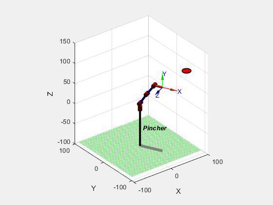
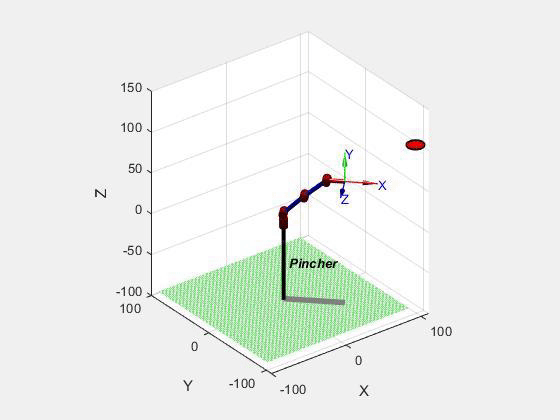

 * This project intends to plan the trajectory for the Pincher manipulator to capture the flying object with the robotic arm. The mathematical analysis for the manipulator kinematics and dynamics during the capturing task is proposed and veriflied with the MATLAB Robotics Toolbox and GTSAM. The feasiblity of the trajectory plan is verified within several scenarios.

---
