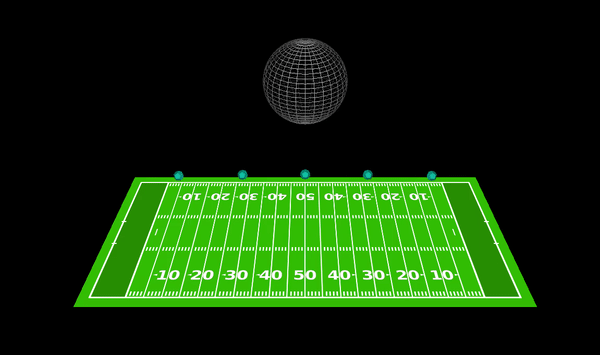

Buzzcup intends to simulate the PID control on the circluar motion of multiple agents. The environment is based on the OpenGL and each agent is controlled by a independent thread that communicates via MPI. My responsibily in this project covers:
 * Investigate the multi-thread programming tool for C++, designed the multi-agent control system with MPI to ensure all the agents are controlled by an independent thread
 * Implement the PID control method based on the agent’s distance to the sphere center to stabilize the agent’s trajectory during its transferring process and rotating on the sphere
 * Visualize the simulation environment with 3-D computer graphics package OpenGL, presented the playground, intended sphere for surrounding and agents with their trajectory during the simulation
---
