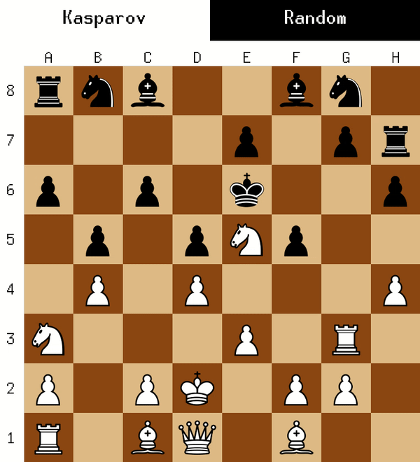

The AlphaZero chess player is the course project for Robotic Intelligence: Planning in Gatech. The general idea of this project is to utilize the AlphaZero model that is derived from the Monte-Carlo Search Tree (MCTS) on the partially observable chess playing environment. To estimate the opponent status on the board since it's unavailale for the current player, the practicle filter on king tracking is incorporated with the AlphaZero model. My responsibility in this project covers: 
 * Regulated the fully and partially observable chess playing task, implemented the vanilla Monte-Carlo Search Tree on the chess playing task
 * Implemented the AlphaZero method by incorporating the neural network for state evaluation and decision making with the MCTS, implemented the particle filter on the opponent's king tracking task to optimize the model
 * Integrated the modules for different tasks into the feasible agent, established the training and testing framework, implemented the chess player agent on the partially observable chess playing environment
---
